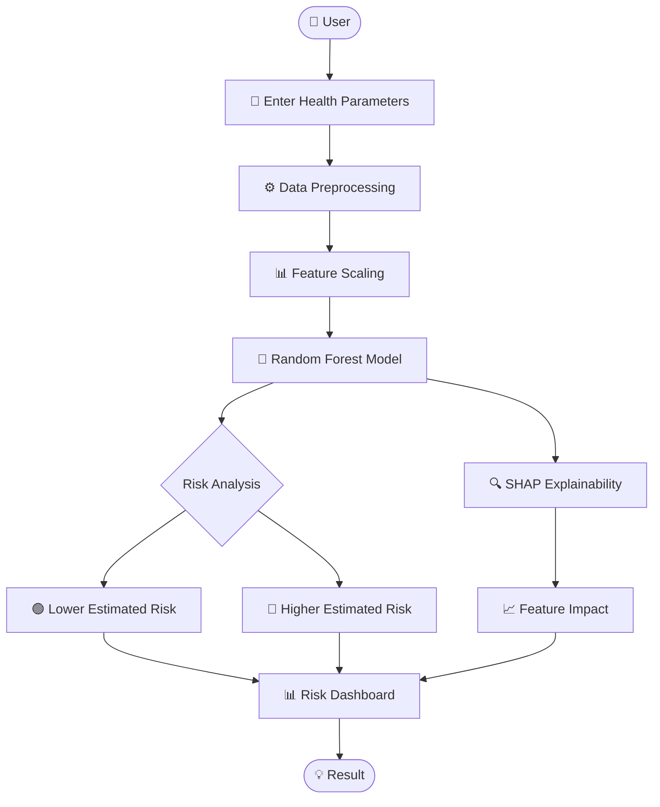

# ❤️ CardioAI Predictor

<p align="center">
  <strong>AI-Powered Heart Disease Risk Assessment</strong><br/>
  Machine Learning • Explainable AI • Streamlit
</p>

<p align="center">

<a href="https://heart-diseaseprediction-zhl7t64qx8w9h5zna3vrce.streamlit.app/">

</a>


</p>

---

## 🎬 Live Demo

<p align="center">

<a href="https://heart-diseaseprediction-zhl7t64qx8w9h5zna3vrce.streamlit.app/">

</a>

</p>

---

## 🖥️ Real App Preview

<p align="center">

</p>

<p align="center">

</p>

<p align="center">

</p>

---

## 🧠 How It Works



---

## 🔥 ML Pipeline

```text
Patient Data
     │
     ▼
┌───────────────┐
│ Preprocessing │
└───────┬───────┘
        ▼
┌───────────────┐
│ Feature Scale │
└───────┬───────┘
        ▼
┌────────────────┐
│ Random Forest  │
│    Classifier  │
└───────┬────────┘
        │
   ┌────┴────┐
   ▼         ▼
Risk Score  Prediction
   │         │
   └────┬────┘
        ▼
┌────────────────┐
│ SHAP Analysis  │
└───────┬────────┘
        ▼
📊 Explainable Dashboard
```

---

## ⚡ Features

| Feature | Description |
|---|---|
| 🧠 ML Prediction | Random Forest based risk estimation |
| 📊 Risk Dashboard | Probability & confidence visualization |
| 🔍 SHAP | Explains feature contribution |
| 🔐 Privacy First | No persistent user data storage |
| ⚡ Streamlit | Interactive web interface |
| 📈 Visual Analytics | Clear prediction insights |

---

## 🛠️ Tech Stack

```text
🐍 Python
│
├── Streamlit
├── Scikit-Learn
├── Pandas
├── NumPy
├── Matplotlib
├── Plotly
└── SHAP
```

---

## 📁 Project Structure

```text
Heart-diseaseprediction/
│
├── app.py
├── train_and_save_model.py
│
├── heart_disease_model.pkl
├── scaler.pkl
├── feature_columns.pkl
├── model_metadata.pkl
├── feature_importance.csv
└── X_train_scaled_sample.pkl
```

---

## 🚀 Run Locally

```bash
git clone https://github.com/AkshatRaj00/Heart-diseaseprediction.git

cd Heart-diseaseprediction

pip install -r requirements.txt

streamlit run app.py
```

Then open:

```text
http://localhost:8501
```

---

## 📊 Model

The project uses a **Random Forest Classifier** trained on clinical health parameters to produce an estimated heart-disease risk probability. The application also uses **SHAP-based explainability** to show how input features influence the model output.

---

## ⚠️ Medical Disclaimer

> This project is for **educational and informational purposes only**.  
> It is **not a medical diagnostic system** and should not replace professional medical advice, diagnosis, or treatment.

---

<p align="center">

### ❤️ CardioAI Predictor

<strong>Turning health data into explainable ML insights.</strong>

<br/><br/>

Built with 🧠 Machine Learning + ❤️ Technology

</p>
